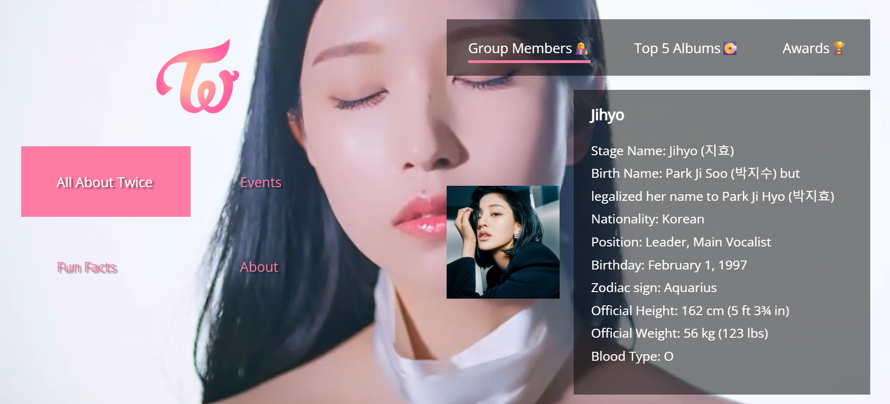
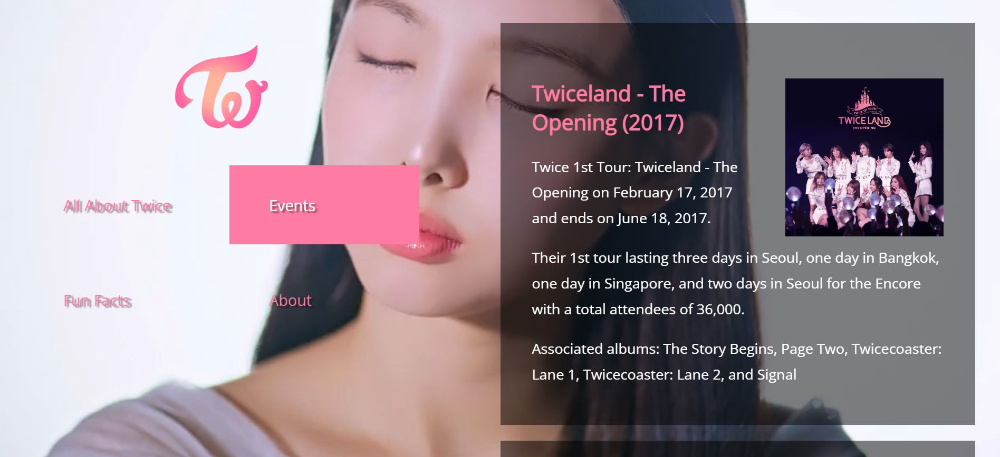
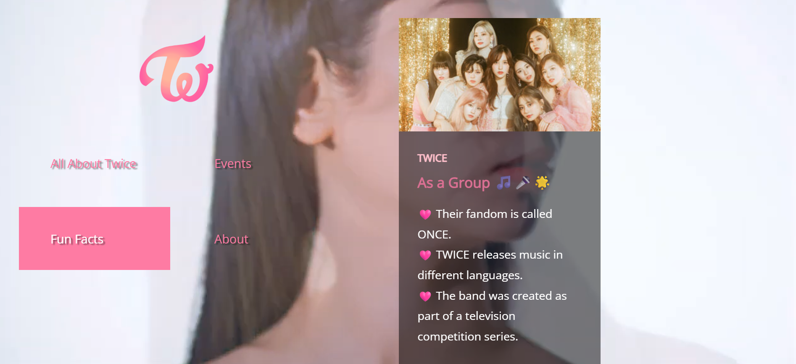
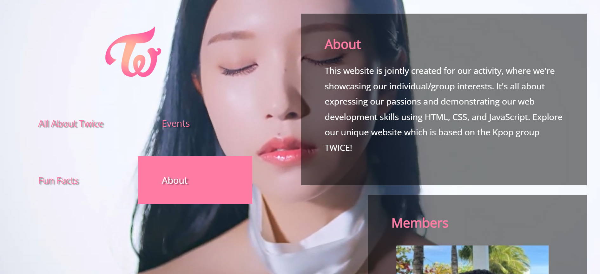

# TWICE Fan Website 🎶✨

A collaborative website project showcasing our shared interest in the K-pop group **TWICE**, while also demonstrating our front-end web development skills using **HTML**, **CSS**, and **JavaScript**.

👉 [View Live Website](https://gr-web-intrst.vercel.app/)  

---

## 📖 About

This website was created as part of a school activity, where each member contributed to express their individual and group interests.  
Our goal was to build something fun, interactive, and informative — all centered around the group **TWICE**!

You can explore:
- Member bios
- Albums, awards and discography
- Events
- Fun Facts
- Interactive elements styled with custom CSS and JavaScript

---

## 🔧 Tech Stack

- **HTML5**
- **CSS3**
- **JavaScript**

---

## 🖼️ Screenshots

  

    
    
  

   

  

    
    
  

---

## 👥 Collaborators

- [Nolly Alvarado](https://github.com/yourusername)  
- [Jestro De Castro](https://github.com/JesDC)  
- [Angelo Padilla](https://github.com/Ghelo419)
- [Edan Fher Raymundo](https://github.com/016Dan)
- [Ronald Labrado Jr.](https://github.com/RonaldJr)  
